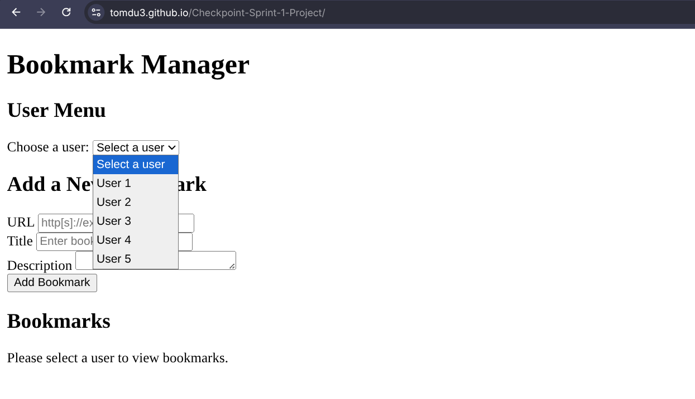
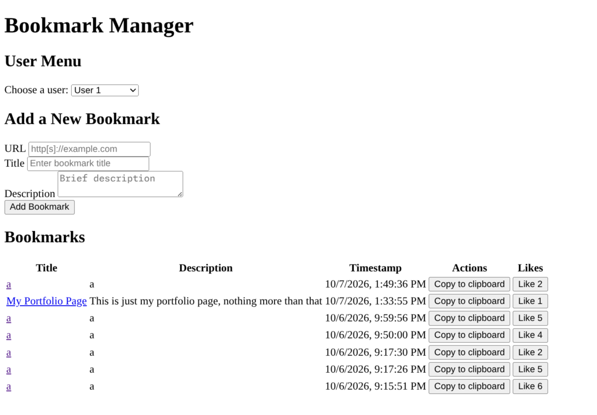
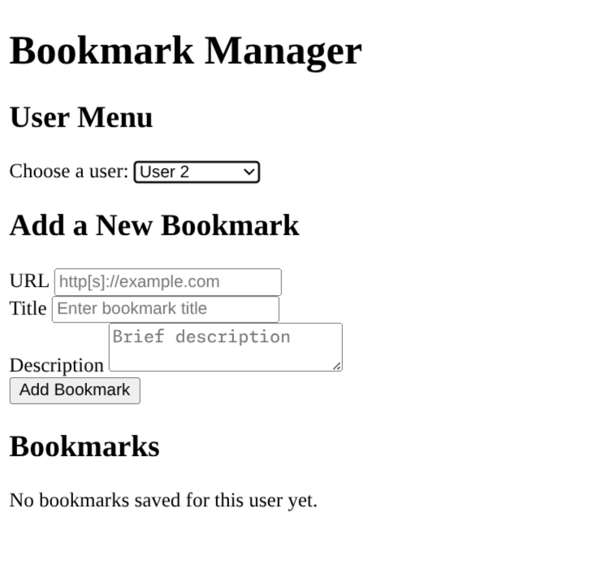
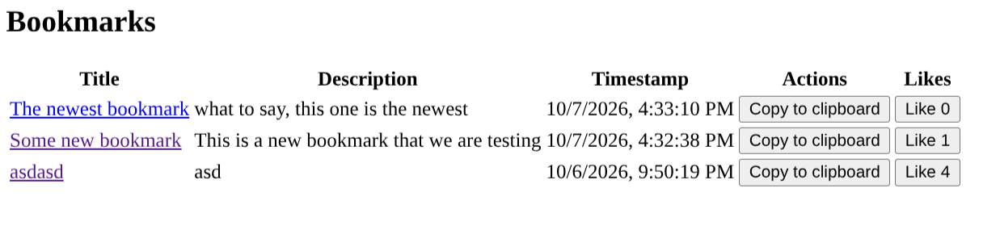
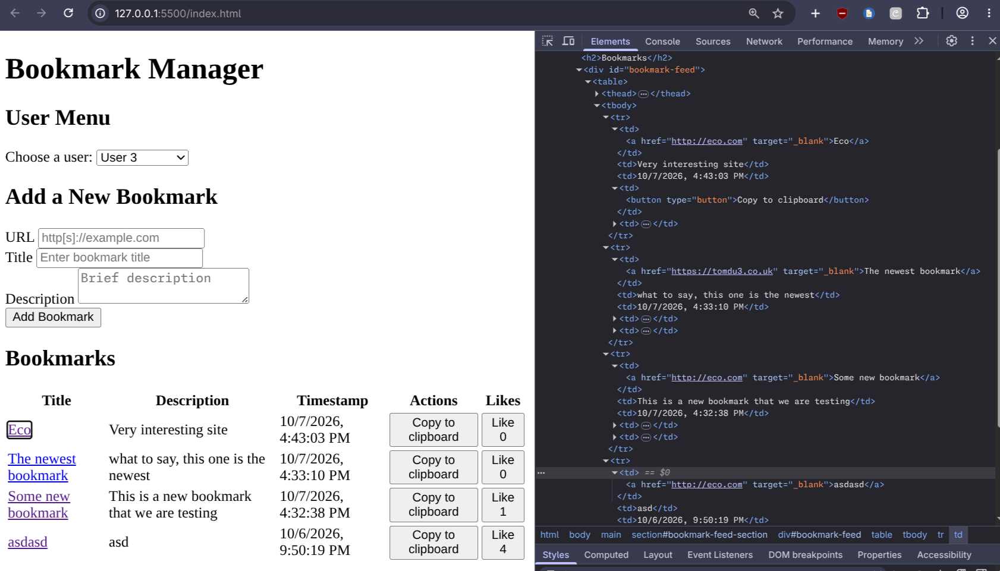
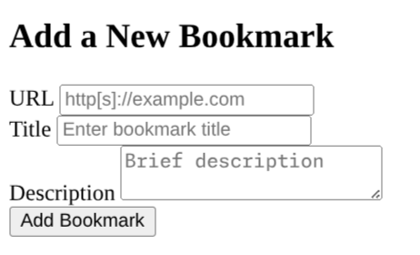
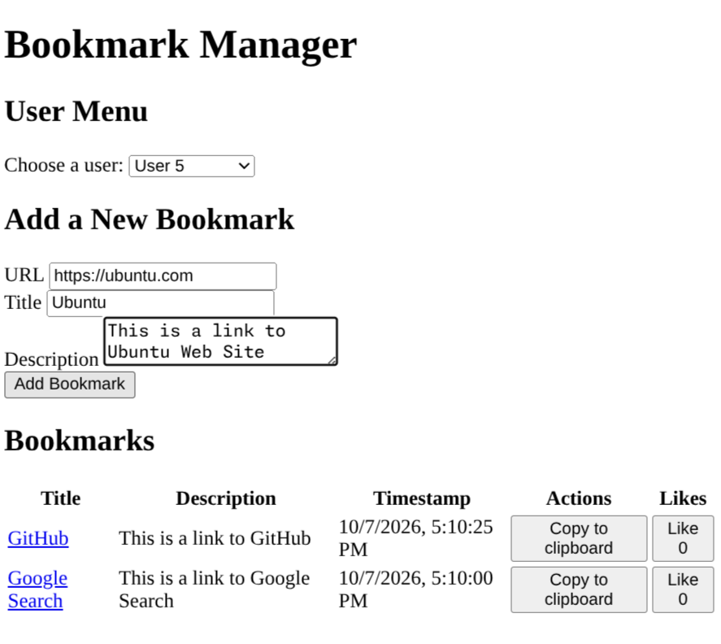
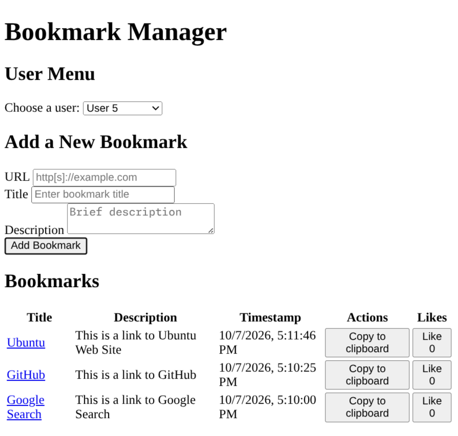
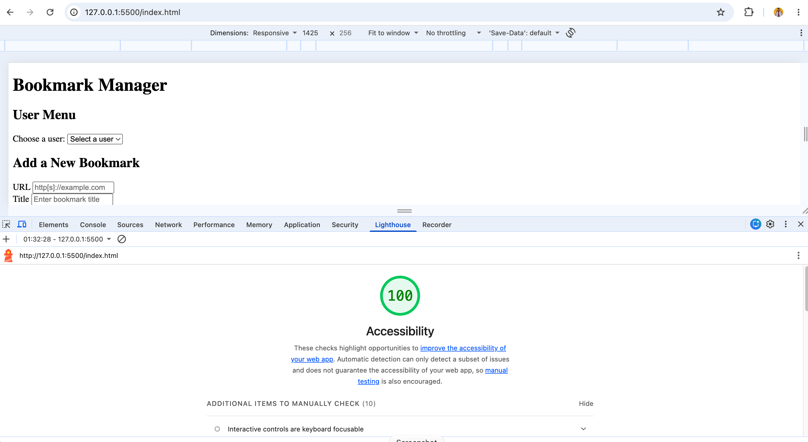
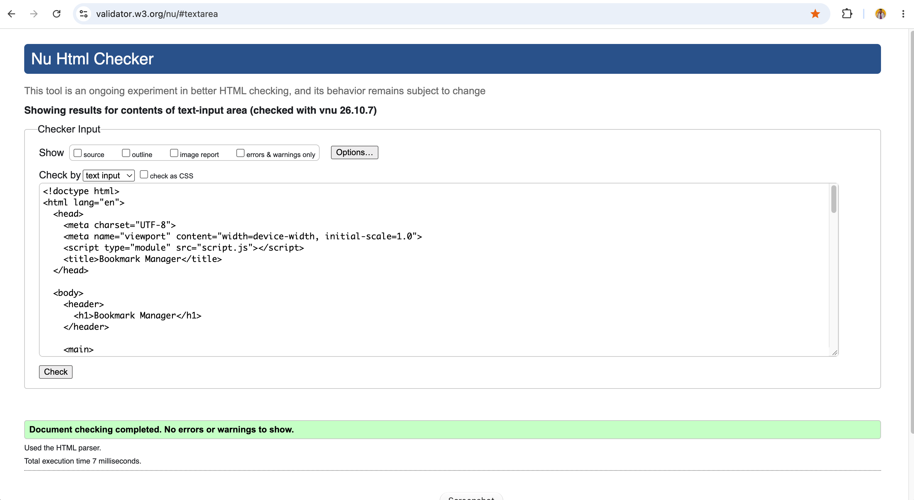

# Testing Documentation

This document outlines the testing strategy and verifies that each requirement from the project rubric has been tested and verified.

## Rubric Requirements Testing

- [x] 1. The website must contain a drop-down which lists five users
  - We have fetched 5 users from our `getUserIds()` helper function to populate the dropdown list.
    

- [x] 2. Selecting a user must display the list of bookmarks for the relevant user
  - When we select a user from the dropdown, the list of bookmarks related to that user is displayed.
    

- [x] 3. If there are no bookmarks for the selected user, a message is displayed to explain this
  - When we select a user with no bookmarks, a message is displayed to explain this.
    

- [x] 4. The list of bookmarks must be shown in reverse chronological order
  - When we select a user, their bookmarks are shown in reverse chronological order.
    

- [x] 5. Each bookmark has a title, description and created at timestamp displayed
  - As seen in the previous images, each bookmark has a title, description and created at timestamp displayed. These details are displayed in tabular format with columns as title, description, timestamp, actions and likes.

- [x] 6. Each bookmark’s title is a link to the bookmark’s URL
  - When we click on the title of a bookmark, it opens the URL in a new tab. The screenshot below shows that the titles are hyperlinks (in the developer tools' elements tab).
    

- [x] 7. Each bookmark's "Copy to clipboard" button must copy the URL of the bookmark
  - When we click on the "Copy to clipboard" button, the URL of the bookmark is copied to the clipboard. We have verified this by pasting the URL into a text editor or browser's address bar.

- [x] 8. Each bookmark's like counter works independently, and persists data across sessions
  - When we click on the like button, the like count goes up by one and is displayed. We have verified that the like count persists across sessions by closing and reopening the browser and selecting the same user.

- [x] 9. The website must contain a form with inputs for a URL, a title, and a description. The form should have a submit button.
  - The screenshot below shows the bookmark form with inputs for a URL, a title, and a description. The form also has a submit button `Add Bookmark`.

    

- [x] 10. Submitting the form adds a new bookmark for the relevant user only
  - When we submit the form, the new bookmark is added to the list of bookmarks for the selected user.
    

- [x] 11. After creating a new bookmark, the list of bookmarks for the current user is shown, including the new bookmark
  - After submitting the form, the new bookmark is added to the list of bookmarks for the selected user.
    

- [x] 12. The website must score 100% for accessibility in Lighthouse in the Desktop device mode, for all views in the website.
  - We tested the website using Lighthouse in Desktop mode and achieved a 100% accessibility score.
  - The screenshot below shows the Lighthouse accessibility result.

  

- [x] 13. Unit tests must be written for at least one non-trivial function
  - We have written unit tests for the `formatTimestamp`, `sortBookmarks` functions in the [`script.test.js`](./script.test.js) file. Here's the output of the `npm test` command:
  ```
    ✔ formatTimestamp returns a formatted date string for a valid ISO timestamp (19.946951ms)
    ✔ formatTimestamp returns an empty string for missing or invalid timestamps (0.206738ms)
    ✔ sortBookmarks returns empty array when given empty list or invalid input (4.945163ms)
    ✔ sortBookmarks sorts bookmarks in reverse chronological order (newest first) (0.243616ms)
    ✔ sortBookmarks does not change the original array (0.281471ms)
    ℹ tests 5
    ℹ suites 0
    ℹ pass 5
    ℹ fail 0
    ℹ cancelled 0
    ℹ skipped 0
    ℹ todo 0
    ℹ duration_ms 34.195821
  ```
- [x] 14. The project must not contain any dead code. All written JavaScript and CSS must be used.
  - The document doesn't seem to have any dead code, with the exception of the provided `clearData` function in `storage.js`, which we haven't used in our code, but it was indicated that we shouldn't need to modify it in order to complete the project.

## Additional Validation

### HTML Validation

The HTML was checked using an HTML validator to identify markup and accessibility-related validation errors.

The reported validation issues were corrected, including:

- Removing unnecessary trailing slashes from void HTML elements.
- Moving `aria-describedby` to the appropriate user-selection element.
- Re-validating the HTML after the fixes.


